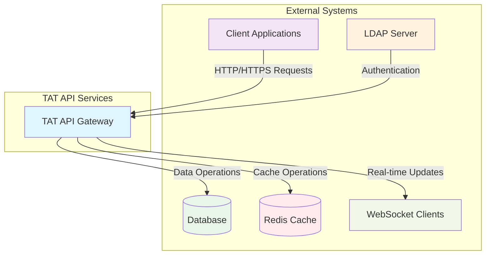
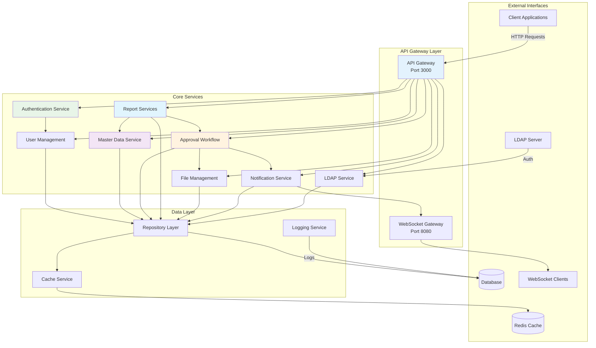
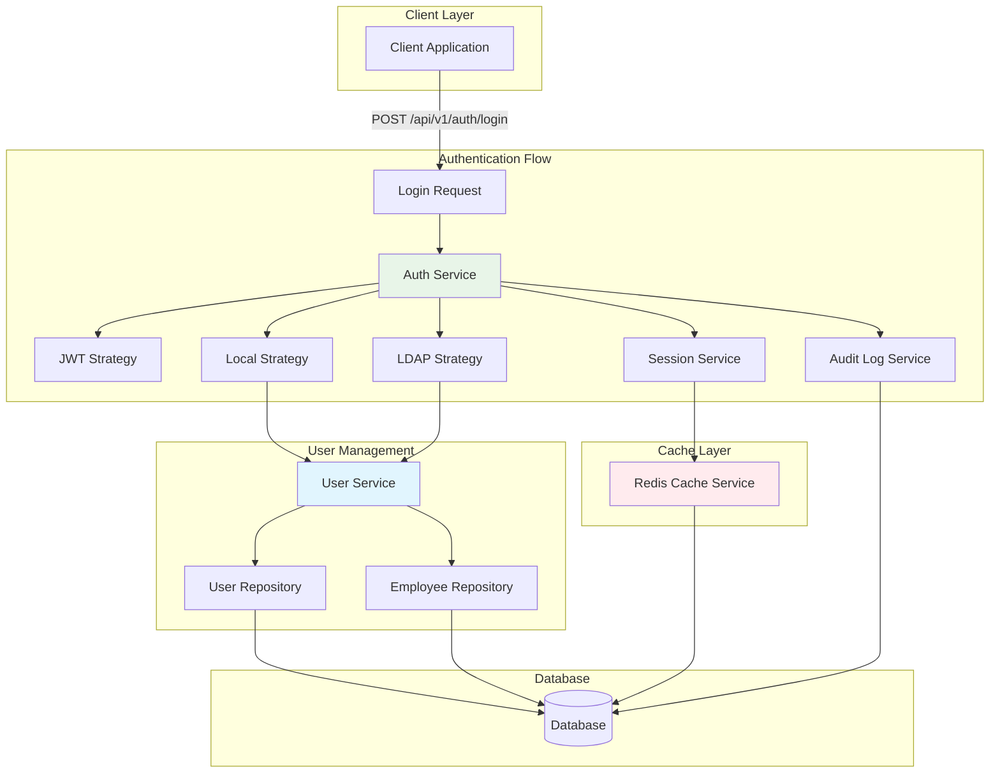
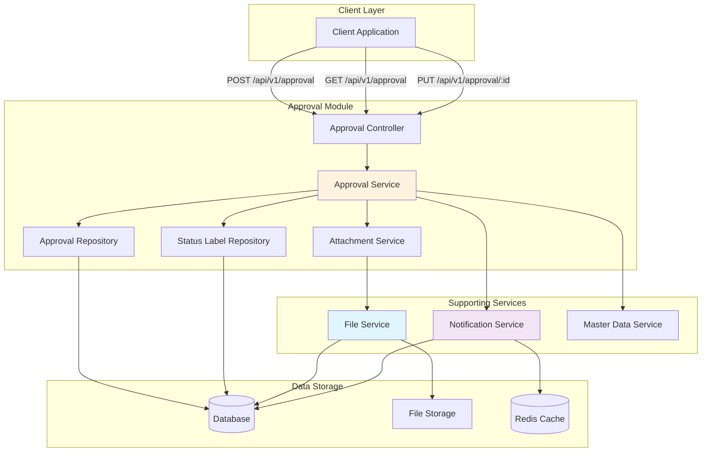
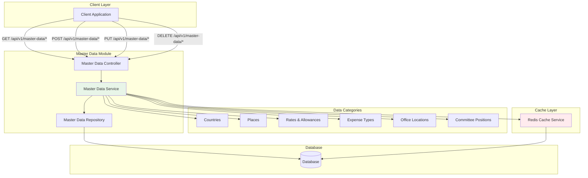
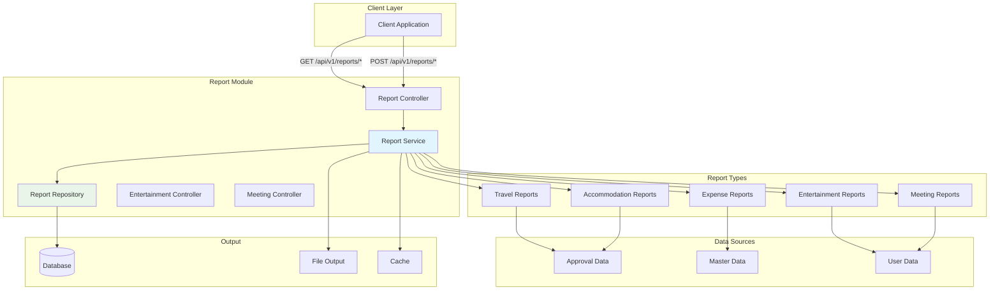
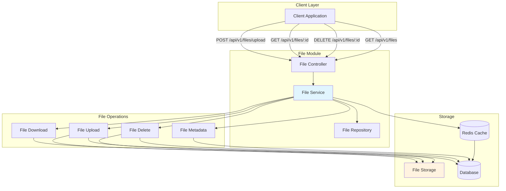
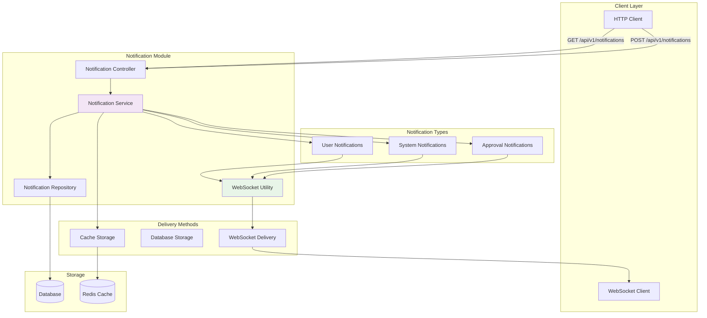
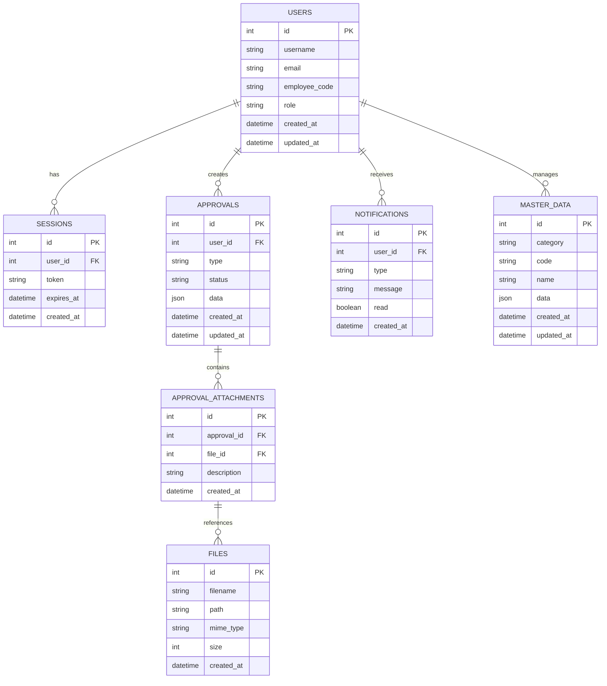

# TAT API Services - Data Flow Diagram (DFD)

## Level 0 - Context Diagram

## Level 1 - System Overview

## Level 2 - Authentication & User Management Flow

## Level 2 - Approval Workflow Data Flow

## Level 2 - Master Data Management Flow

## Level 2 - Report Generation Flow

## Level 2 - File Management Flow

## Level 2 - Notification & WebSocket Flow

## Level 3 - Database Schema Overview

## Data Flow Summary

### Key Data Flows:
1. **Authentication Flow**: Client → Auth Service → User Service → Database/Cache
2. **Approval Workflow**: Client → Approval Service → File Service → Notification Service
3. **Master Data Management**: Client → Master Data Service → Cache → Database
4. **Report Generation**: Client → Report Service → Multiple Data Sources → Output
5. **File Operations**: Client → File Service → File Storage + Database
6. **Real-time Notifications**: Services → Notification Service → WebSocket → Clients

### Data Storage:
- **Primary Database**: PostgreSQL/MySQL via Knex.js
- **Cache Layer**: Redis for performance optimization
- **File Storage**: Local file system or cloud storage
- **Session Storage**: Redis for user sessions

### Security Features:
- JWT-based authentication
- Role-based access control
- LDAP integration
- Audit logging
- Request validation and sanitization

This DFD represents a comprehensive travel and expense management system with approval workflows, real-time notifications, and extensive master data management capabilities.
